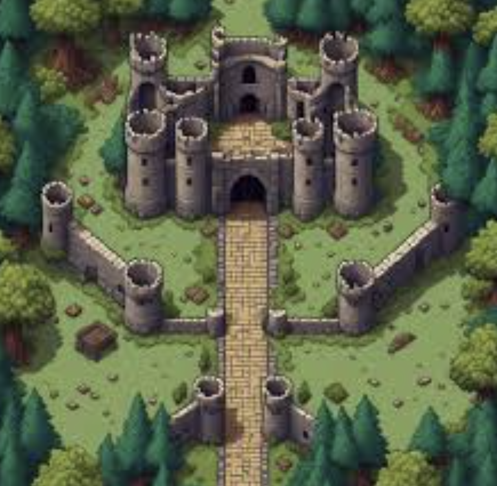
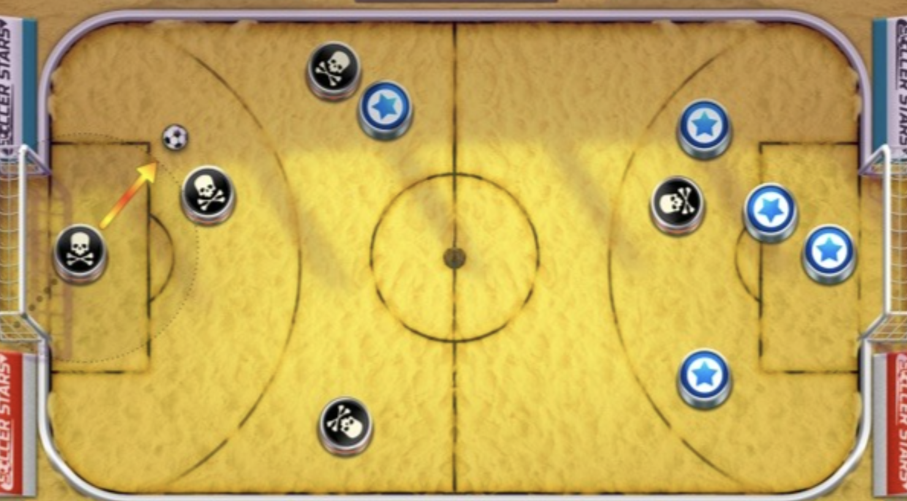

# Slide Battle - Game Design Document

## Summary
A top down 2D multiplayer battle game where each player controls an army of units. The objective is to defeat the opponent's army by strategically deploying and commanding your units on the battlefield.

Quick overview of the game:
- Genre: Turn-based tactics
- Perspective: Top-down 2D
- Player vs. AI or Player vs. Player
- Player 1 at the bottom of the screen, Player 2 at the top

## Units
Unit | Description | Health | Attack | Movement | Range
--- | --- | --- | --- | --- | ---
Swordsman | Basic melee unit | 100 | 20 | Straight Line | 0 (must contact enemy)
Archer | Ranged unit | 80 | 15 | Straight Line | 100 (can shoot from a distance)
Knight | Heavy melee unit | 150 | 30 | Curved Line (can slide behind or flank enemies) | 0 (must contact enemy)

## Damage and Health
If a swordsman hits another swordsman, it will deal 20 damage.
If a swordsman hits an archer, it will deal 40 damage.
If a swordsman hits a knight, it will deal 10 damage.

If an archer arrow hits a swordsman, it will deal 15 damage.
If an archer arrow hits another archer, it will deal 30 damage.
If an archer arrow hits a knight, it will deal 10 damage.

If a knight hits a swordsman, it will deal 30 damage.
If a knight hits an archer, it will deal 50 damage.
If a knight hits another knight, it will deal 20 damage.

## Moving and Attacking
When a sliding player collides with an enemy unit, it will automatically attack that unit. The damage dealt is based on the type of the attacking unit and the type of the defending unit. If a unit's health drops to 0 or below, it is removed from the battlefield.

If an enemy unit got hit by a sliding unit but is not killed, it will be knocked back in the opposite direction of the attack. The distance of the knockback is determined by the strength of the attack. If the knocked back unit collides with a wall or another friendly unit, it will stop moving.

### Swordsman
The player touches/clicks and holds on the swordsman unit. The player drags in the opposite direction of the desired movement. An arrow indicates the direction of the movement but not the distance. The farther the player drags, the stronger the movement will be. The player releases the touch/click to move the unit. The swordsman can only move in a straight line and must come into contact with an enemy unit to attack. Upon releasing the touch/click, the swordsman will slide in the opposite direction of the drag. If it collides with an enemy unit, it will attack that unit. If it collides with a wall or another friendly unit, it will stop moving.

### Archer
Movement works the same as with the swordsman. But the archar has two areas where the user can click/touch. One for movement and one for shooting. When the player clicks/touches the shooting area, they can drag and an arrow will show the opposite direction of the drag indicating the direction of the shot. The further the player drags, the stronger the shot will be. This will only be visualized by the color and boldness of the arrow, NOT by the length. Upon releasing the touch/click, the archer will shoot an arrow in the opposite direction of the drag. If the arrow collides with an enemy unit, it will deal damage to that unit.

### Knight
The movement works exactly the same as the swordsman, but the knight can move in a curved line. After dragging and releasing the touch/click, the knight will not immediately slide but the user can control the curve of the movement by dragging the arrow left or right. Only after releasing a second time, the knight will start moving in the curved line. If the knight collides with an enemy unit, it will attack that unit. If it collides with a wall or another friendly unit, it will stop moving.

## Battlefield / Map
The battlefield has NO GRID. It is an open area where players can freely move their units. The battlefield will have some obstacles (e.g., walls, rocks) that can block movement and line of sight for attacks. Players must navigate around these obstacles to effectively position their units and attack the opponent.

## User Interface
### Main Menu Interface
In the main menu, we see a background of a battlefield with two buttons:
- "Play vs AI" button to start a single-player game against the computer.
- "Quit" button to exit the game.

### Battle Interface
The user interface during the battle will include the following elements:
- Health bars above each unit to indicate their current health status.
- Action points display to show how many action points the player has left for the current turn.
- A "Ready" button for players to confirm they are ready to start the battle.
- A turn indicator to show which player's turn it is.
- A victory screen that appears when one player wins the battle.
- A "Give Up" button that allows a player to concede the battle and declare the opponent as the winner.

## Game Loop
1. Before the battle, players select their units and arrange them on the battlefield. Each player confirms with a "Ready" button.
2. Once both players are ready, the battle begins.
3. Each player has 3 action points per turn to move and attack with their units. Players can choose to move, attack, or end their turn. Action points are shown and updated as the user performs actions.
4. After a player ends their turn, the other player takes their turn.
5. The game continues until one player's army is completely defeated (all units have 0 health or below). The player with remaining units is declared the winner.

## Visual Style
Muted colors like in the battlefield screenshot below.
Smooth sliding and shooting animations.

Battlefield:

Units:
Should be round and with the icon based on the unit type. The color of the unit will indicate which player it belongs to (e.g., blue for Player 1 and red for Player 2). Also a health bar will be displayed above each unit to indicate its current health status.

## Technical Requirements
The game should run in the browser.
The game should have an AI opponent for single-player mode.